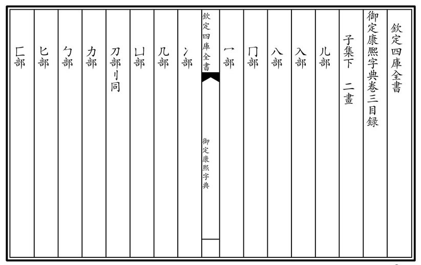
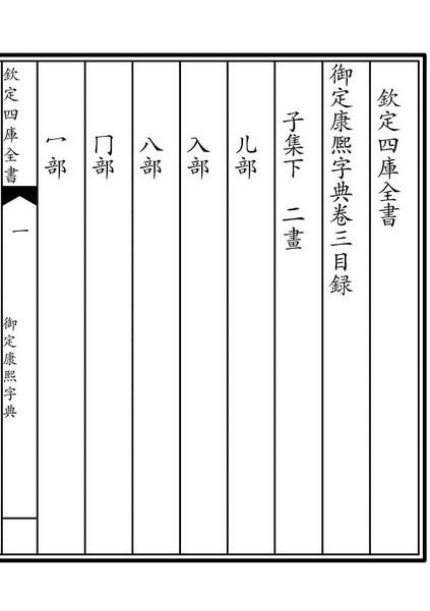
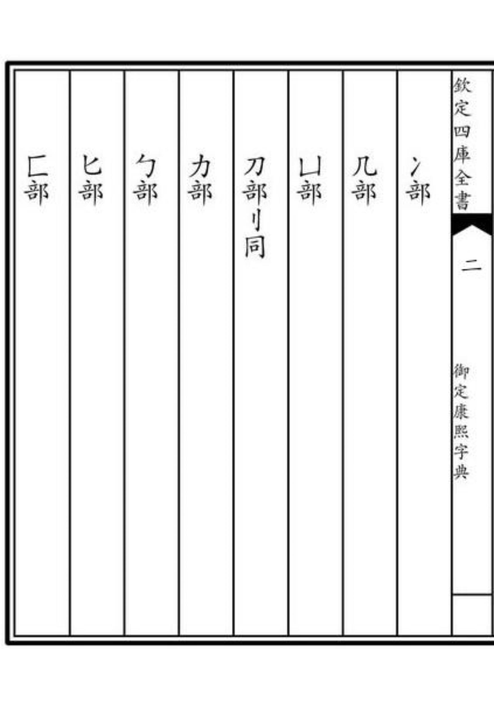

# all-kinds-of-little-tools

#### 介绍
​	自己写的（或整理别人的）各种各样的使用小工具

#### 软件架构

​	都是一些小工具，使用的语言不限。每更新一个工具都会对应写上使用说明

#### 使用说明

1. 调用讯飞api文字识别小工具

   复制代码，使用pip安装所需的工具，并在讯飞官网申请api，填写自己申请到的URL、APPID和APP_KEY即可。

   

2. 图片分割并添加中文页码小工具

   示例：

   这是未分割且未添加页码的原图

   

   这是已分割且已添加页码的输出结果

   

   

   使用时将待处理图片放到in文件夹中，运行代码后输出结果在out文件夹中。
